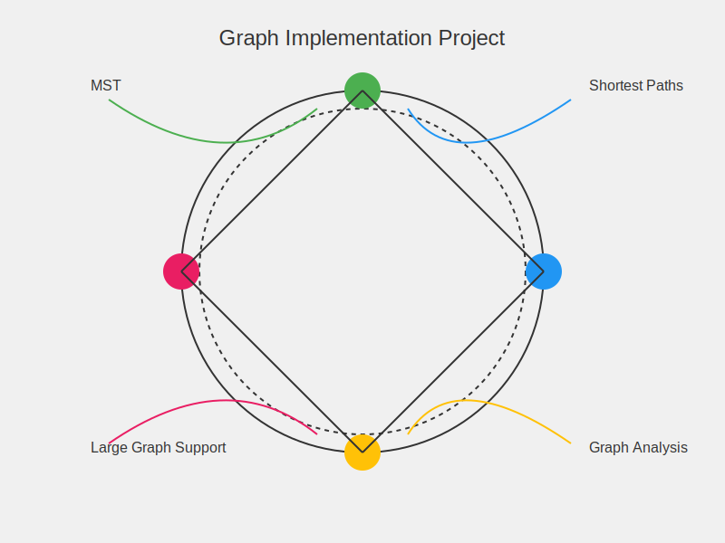

# GraphNexus: Advanced Graph Implementation Project



GraphNexus is a powerful, efficient, and versatile Java library for working with weighted, undirected graphs. It provides a comprehensive toolkit for graph creation, manipulation, and analysis, featuring advanced algorithms like Minimum Spanning Tree (MST) computation and shortest path calculations.

## Table of Contents
1. [Introduction](#introduction)
2. [Features](#features)
3. [Technical Details](#technical-details)
4. [Getting Started](#getting-started)
   - [Prerequisites](#prerequisites)
   - [Installation](#installation)
5. [Usage](#usage)
   - [Loading a Graph](#loading-a-graph)
   - [Basic Operations](#basic-operations)
   - [Advanced Algorithms](#advanced-algorithms)
6. [API Reference](#api-reference)
7. [Implementation Details](#implementation-details)
8. [Performance Optimization](#performance-optimization)
9. [Testing](#testing)

## Introduction

GraphNexus is designed to be the nexus of graph operations in your Java projects. Whether you're working on small networks or large-scale graph structures with thousands of vertices and edges, GraphNexus provides the tools you need for efficient graph manipulation and analysis.

Developed as a personal project to explore the intricacies of graph theory and algorithm implementation, GraphNexus aims to offer a balance between performance and usability, making it suitable for both educational purposes and real-world applications.

## Features

- **Flexible Graph Creation**: Load graphs from files or programmatically create them using edge and weight lists.
- **Efficient Data Structures**: Optimized internal representations for lightning-fast graph operations.
- **Comprehensive Graph Operations**: 
  - Vertex and edge management
  - Adjacency queries
  - Weight retrieval
- **Advanced Algorithms**:
  - Minimum Spanning Tree (MST) computation
  - Single-source shortest path calculations
  - Subgraph analysis and reporting
- **Large Graph Support**: Efficiently handles graphs with 10,000+ vertices and edges.
- **Extensive Testing**: Comprehensive test suite ensuring correctness and performance.
- **Well-Documented API**: Clear and detailed documentation for all public methods.

## Technical Details

- **Language**: Java (compatible with Java 8+)
- **Graph Representation**: Adjacency list for sparse graphs, with options for matrix representation for dense graphs
- **MST Algorithm**: Prim's algorithm with a priority queue implementation
- **Shortest Path Algorithm**: Dijkstra's algorithm with optimized data structures
- **Time Complexity**: 
  - MST: O(E log V)
  - Shortest Path: O((V + E) log V)
  - Basic operations: O(1) average case

## Getting Started

### Prerequisites

- Java Development Kit (JDK) 8 or higher
- Java IDE (optional, but recommended)

### Installation

1. Clone the repository:
   ```
   git clone https://github.com/Abhay-2004/GraphNexus-Advanced-Graph-Implementation-Project.git
   ```
2. Navigate to the project directory:
   ```
   cd GraphNexus-Advanced-Graph-Implementation-Project
   ```
3. Compile the Java files:
   ```
   javac com/GraphNexus-Advanced-Graph-Implementation-Project/*.java
   ```

## Usage

### Loading a Graph

From a file:

```java
Graph g = new Graph();
g.load("path/to/graph/file.txt");
```

Programmatically:

```java
List<String> edges = Arrays.asList("A", "B", "B", "C", "C", "A");
List<Integer> weights = Arrays.asList(1, 2, 3);
g.load(edges, weights);
```

### Basic Operations

```java
// Check if vertex exists
boolean hasA = g.hasVertex("A");

// Get number of vertices and edges
int vertexCount = g.getVertexCount();
int edgeCount = g.getEdgeCount();

// Check if edge exists and get its weight
boolean hasEdgeAB = g.hasEdge("A", "B");
int weightAB = g.getWeight("A", "B");

// Get adjacent vertices
Iterable<String> neighborsOfA = g.getAdjacent("A");
```

### Advanced Algorithms

Minimum Spanning Tree:

```java
List<String> mst = g.getMST();
System.out.println("MST edges: " + mst);
```

Shortest Paths:

```java
String startVertex = "A";
Map<String, Integer> shortestPaths = g.getShortestPaths(startVertex);
shortestPaths.forEach((vertex, distance) -> 
    System.out.println("Shortest distance from " + startVertex + " to " + vertex + ": " + distance));
```

Subgraph Analysis:

```java
List<String> subgraph = Arrays.asList("A", "B", "B", "C");
Set<String> report = g.getReport(startVertex, subgraph);
System.out.println("Vertices in subgraph with same shortest path: " + report);
```

## API Reference

### `Graph` Interface

- `void load(String pathToFile) throws Exception`
- `void load(List<String> edges, List<Integer> weights) throws Exception`
- `int getVertexCount()`
- `boolean hasVertex(String v)`
- `Iterable<String> getVertices()`
- `int getEdgeCount()`
- `boolean hasEdge(String u, String v)`
- `int getWeight(String u, String v)`
- `Iterable<String> getAdjacent(String u)`
- `List<String> getMST()`
- `Map<String, Integer> getShortestPaths(String s)`
- `Set<String> getReport(String s, List<String> subgraph)`

## Implementation Details

GraphNexus primarily uses an adjacency list structure, implemented as a `Map<String, Map<String, Integer>>`. This allows for efficient storage and retrieval of edge information, especially for sparse graphs.

Key algorithms:

1. **MST (Prim's Algorithm)**: Utilizes a priority queue to efficiently select the next minimum-weight edge.
2. **Shortest Paths (Dijkstra's Algorithm)**: Implements a priority queue-based approach for optimal performance.
3. **Subgraph Analysis**: Employs a breadth-first search (BFS) strategy to explore the subgraph and compare path lengths.

## Performance Optimization

- **Lazy Loading**: Graph data is loaded and processed only when needed.
- **Caching**: Frequently accessed results (like adjacency information) are cached for faster retrieval.
- **Efficient Data Structures**: Custom implementations of priority queues and hash-based structures for improved performance.
- **Algorithm Tweaks**: Optimized versions of classical algorithms to handle large graphs efficiently.

## Testing

GraphNexus includes a comprehensive test suite covering various scenarios:

- Unit tests for individual methods
- Integration tests for complex operations
- Performance tests for large graphs
- Edge case handling


